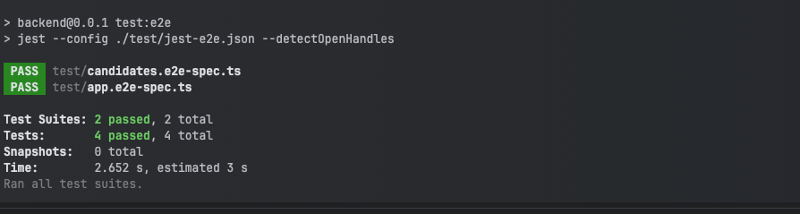

# Candidates Registration

## Libraries/Frameworks used

- **Backend** : Nestjs, TypeScript, Typeorm, Jest, SuperTest, Postgres
- **Frontend** : React, TypeScript, Taiwlind, Material UI, Jest, React Testing Library

## Design decisions

### Backend
- API Design : The API is implemented [Nestjs](https://nestjs.com/). It supports offset-limit based pagination for the list of candidates.
- Testing : All the Rest operations are tested using integration test cases using Jest and SuperTest.
- Linting & Formatting : The codebase is linted using ESLint and formatted using Prettier.
- Deployment : The Nestjs nodejs server can be dockerized and deployed in container orchestration platforms like Kubernetes or AWS EKS, ECS or Fargate.
- Logging & Monitoring : The application logs and metrics can be logged and monitored in services like AWS CloudWatch or Datadog.

### Frontend
-  **Code Organisation** : The `components` directory contains all the reusable artifacts. The `pages` directory contain the navigable pages in the UI.
-  **Testing** : The usecases are covered with integration testing using React testing library. The components have unit tests using Jest.
-  **Component library** : Components and Grid system of [material-ui](https://material-ui.com/) is used.
-  **Data Fetching** : [SWR Hook](https://swr.vercel.app/) is used with axios. SWR provides faster refresh and caching requests
-  **Component styling** :Tailwind css, saas is used to styles the components and pages.
-  **Linting & Formatting** : The default ESLint is used. Prettier for code formatting. husky and lint-staged are used as auxiliary library.

## Further improvements
- Adding Authentication to the backend and Frontend
- Additional functionalities like the following can be implemented:
    - Filtering and sorting support can be added to the API and the DataTable
    - Switching to dark mode can be added. The useTheme() custom hook used in the code can be extended to implement this feature.
- E2E test cases can be added using Cypress or playwright

## To run locally

Clone the repository 
```bash
git clone https://github.com/wasswarichard/candidates
```
cd into the repository
```bash
cd candidates
```
Inside the repository run
```bash
docker-compose up --build
```

The Backend server will start on 
```bash
http://localhost:3001
```

The Frontend Server will start on
```bash
http://localhost:5173
```

## Test cases snapshot

Backend:



Frontend:


Thanks for your time :)

Using Kubernetes
https://chatgpt.com/share/816ca144-62ba-4757-9130-008b3d924358
